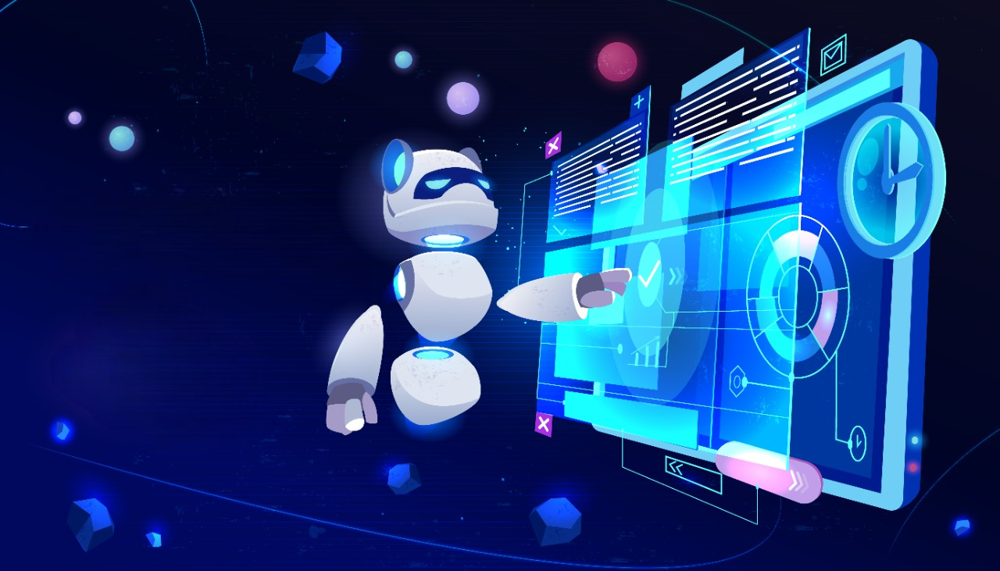

# Robomanipal Coding Taskphase 2023 🤖 

## 📚 Resources

A list of resources to help you get started with the taskphase 🚀.

## 🦦 Taskphase Timeline

The taskphase aims to give you all round exposure to a bunch of technologies and tools 🔧 that is used in the industry.

- [ ] **Week 1** 
    - Introduction to C and C++
- [ ] **Week 2**
    - Introduction to Python
- [ ] **Week 3**
    - Microprocessors and Microcontrollers
    - Introduction to Arduino and Communication Protocols
- [ ] **Week 4**
    - Screening and Taskphase Evaluation
    - Working with sensors
- [ ] **Week 5**
    - Creating a Holonomic Drive
- [ ] **Week 6**
    - Remote control of the bot
- [ ] **Week 7**
    - Dual booting and Linux commands
    - Introduction to ROS2
    - Introduction to Git and Github
    - Basic ROS2 commands
- [ ] **Week 8**
    - Introduction to TurtleSim
    - Introduction to Gazebo
- [ ] **Week 9**
    - OpenCV and Image Processing
    - Tracking an object
- [ ] **Week 10**
    - Artificial Intelligence and Machine Learning
    - Basic AI and ML algorithms (Linear Regression, Logistic Regression, CNN)

## 👓 Appendix

See what's next on our [task board](https://trello.com/invite/b/0kaVuw31/ATTI2c6b319c09955a987938ae0944ac9344FE749BD6/rm-taskphase-coding) ✨ and [let us know](https://github.com/Robomanipal-Taskphase-Coding-2023/.github/issues/new/choose) if you have any suggestions 🙇‍♂️. Oh, and by the way, all the best to everyone in the taskphase make sure to have a blast 🙌.

---

🤫 Psst! You can create your own [repository](https://docs.github.com/en/get-started/quickstart/create-a-repo) here.
